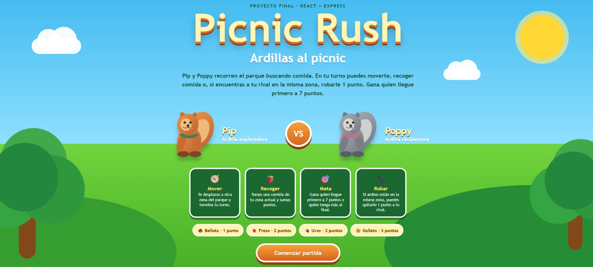

# Picnic Rush: Ardillas al picnic

**Picnic Rush** es un juego web para dos jugadores desarrollado con React + TypeScript en el frontend y Express + TypeScript en el backend.

Pip y Poppy recorren un parque buscando alimentos para sumar puntos. Durante cada turno, el jugador puede moverse a otra zona, recoger una comida disponible o robar un punto al rival cuando ambos se encuentran en la misma zona.

Gana quien alcance primero 7 puntos. Si nadie llega a la meta después de cinco rondas, gana quien tenga la mayor puntuación.

## Aplicación publicada

https://picnic-rush-ardillas.onrender.com

## Video de demostración

https://drive.google.com/drive/folders/1w1evAgSfVN6kZGqT7y5dgChCEfDG8pwm?usp=sharing

## Captura del juego



## Tecnologías

- React
- TypeScript
- Express
- Vite
- CSS
- Fetch API
- Playwright
- GitHub Actions
- Render

## Requisitos

- Node.js 22 o compatible
- npm
- Google Chrome o Chromium para las pruebas E2E visuales

## Instalación

Desde la raíz del proyecto:

```bash
npm install